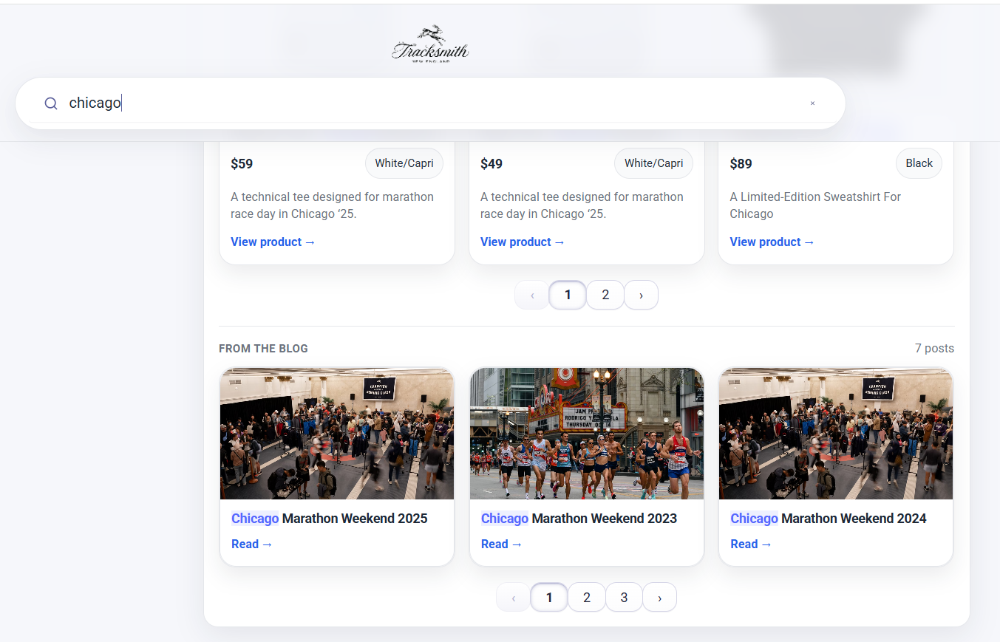

# Algolia Search Implementation – Tracksmith Mock E-Commerce Project

## Live Demo
**View the live project:** 
https://abryancole.github.io/algolia-tracksmith-search/index.html

## Project Overview

This project demonstrates a production-adjacent Algolia-powered search experience, designed to showcase my approach to relevance configuration, search UX, data modeling, and iteration within realistic constraints.

Rather than building a purely theoretical demo, I focused on creating a search experience that reflects real-world commerce and content discovery use cases. The implementation is inspired by **Tracksmith**, a brand I admire as a runner, whose product catalog and editorial content provide strong candidates for demonstrating Algolia’s strengths across both transactional and discovery-driven search.

---

## Initial Approach & Pivot

The project initially began using the provided wine and movie JSON datasets. While conceptually useful, both presented practical limitations that would have negatively impacted the final search experience:

- The wine dataset stored images as base64-encoded data, which could not be easily uploaded or rendered within Algolia.
- The movie dataset referenced image URLs that were no longer valid, resulting in broken imagery in the UI.

Rather than force an incomplete or degraded experience, I pivoted to creating a realistic mock e-commerce environment using data collected from the Tracksmith website. This decision allowed me to better demonstrate how I approach real-world search problems such as product discovery, merchandising, and content integration.

---

## Data Modeling & Index Strategy

The project uses two separate datasets and Algolia indices:

### Product Index
- Apparel and footwear products
- Attributes include:
  - Product name
  - Description
  - Price
  - Color
  - Size
  - Availability
  - Review-related signals

### Blog Index
- Editorial and blog content

Separating products and content into distinct indices enabled tailored relevance configurations for each and supported a federated search experience across multiple content types.

---

## Relevance, Ranking & Search Configuration

To align search results with likely user intent, I configured:

- **Searchable attributes** based on expected keyword behavior (e.g., product name, description, category)
- **Custom ranking** signals that reflect realistic e-commerce priorities, including:
  - In-stock status
  - Higher review counts
  - Stronger review scores
  - Popularity or customer preference indicators

The goal was to let Algolia’s textual relevance operate first, then apply business signals in a way that balances customer intent with merchandising needs.

Additional configuration included:
- English language settings
- Stop words
- Plural handling

These settings help queries behave naturally and reduce friction for common search patterns.

---

## Synonyms, Rules & Merchandising

A key focus area was synonym management, particularly around color naming. Tracksmith uses branded, non-standard color names that may not match how users search. I added multiple synonyms to map common color terms to brand-specific language, improving discoverability and query success.

I also implemented Algolia rules to support light merchandising use cases:

- **Empty search rule** to surface curated product combinations on initial load
- **Query-specific rule for “shoe”** to broaden footwear results rather than returning a narrow subset

These rules demonstrate how Algolia can support curated discovery without hardcoding logic into the frontend.

---

## Facets, Sorting & UI Considerations

To improve usability, I implemented common e-commerce facets, including:

- Color
- Size
- Price

During testing, the size facet initially surfaced shoe sizes first, which created confusion during apparel browsing. I adjusted the logic to default to apparel sizes (S, M, L), with shoe sizes available upon expansion. This reflects a practical tradeoff based on catalog composition.

I also configured index-level sort options (e.g., price ascending/descending). Due to time constraints, these were not fully wired into the UI.

---

## Federated Search & Content Integration

To reflect Tracksmith’s emphasis on editorial storytelling, the project implements federated search that surfaces blog content alongside product results.

- Blog results respond to the same query terms as product search
- Content results are displayed below product results

This approach supports discovery beyond purely transactional intent and mirrors how modern commerce experiences blend products with supporting content.

*Example of federated search results displaying editorial blog content beneath product listings in a federated search experience.*

---

## Constraints, Tradeoffs & Learnings

Given the scope and time constraints of the take-home assessment, I made several intentional tradeoffs:

- Prioritized relevance configuration and realistic search behavior over additional UI polish
- Focused on production-minded Algolia configuration rather than exhaustive frontend features

This project reflects how I would approach a real Algolia implementation: starting with clear user and business goals, making thoughtful configuration decisions, and iterating toward better relevance and discovery. While there are areas I would continue to expand with more time, the final result demonstrates a pragmatic, best-practice-driven search experience.

---

## How to Run

- View the live project: https://abryancole.github.io/algolia-tracksmith-search/index.html
- Open the project locally in a browser (or via a simple local server if required)

> **Note:** This project uses Algolia search-only keys suitable for frontend usage.
